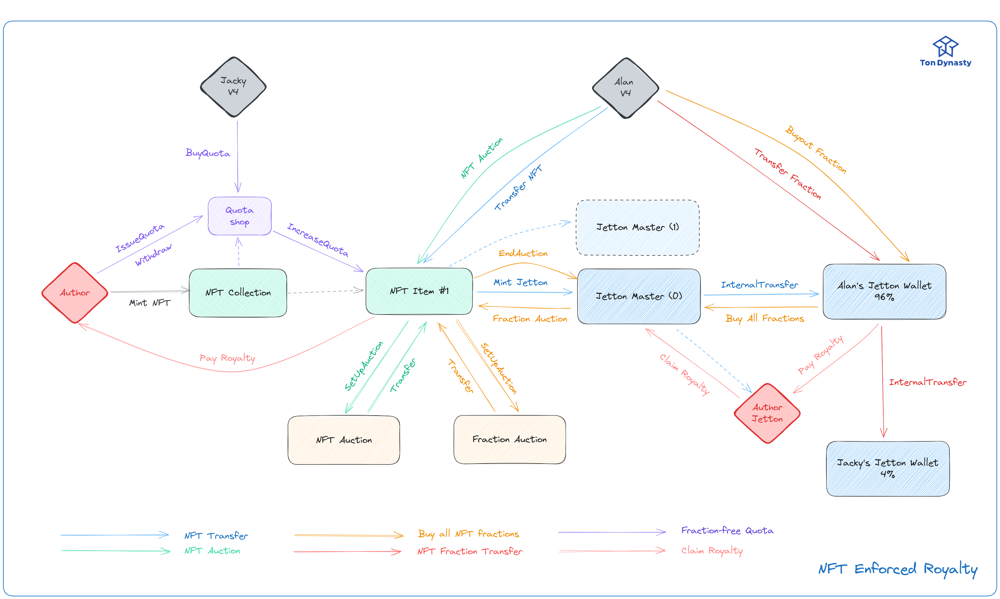

## Introduction

Imagine a world where artists are effortlessly rewarded each time their work changes hands, ensuring their continuous recognition and compensation.💰 Leveraging the groundbreaking power of NFT fractionalization, we've sculpted a solution that is not only intuitively simple but also remarkably effective, seamlessly intertwining with existing NFT standards.

Your journey through the revolutionary pathways of NFT enforced royalties on TON begins here – where the equitable future of digital artistry is being rewritten! 🎨✨

Click **readmore** to learn more about our project.

<!-- truncate -->
## Background

為了更好的理解我們的解決方案，我們在這個章節會介紹 NFT Enforced Royalty 和 Fractionalization 的背景知識。

### What is NFT & Enforced Royalty?

NFT (Non-Fungible Token) 的出現提供了一種可程式化的數位資產，也作為數位藝術品的憑證。NFT 的提出允許作家們能夠持續追蹤使用者的轉手交易 (transfer)，並且在每次轉手交易時，作家們可以獲得一定比例的版稅。

強制執行版稅是一個備受討論的議題，強制版稅可以使創作者獲得應有的收益，不過過高的版稅也會一定程度降低市場的流通性。2023 年 8 月，以太坊上的 NFT 平台 OpenSea 決定取消其鏈上版稅執行工具 — Operator Filter，該工具允許創作者封鎖不執行版稅的 NFT 市場。此舉可能對期望通過版稅獲得被動收入的 NFT 藝術家造成影響，不過可能因此拯救低迷的市場。

### What is Fractionalization?

Fractionalization 是一種將 NFT 分割成多個部分的技術，這些部分可以被不同的持有者擁有。Fractionalization 的出現使得 NFT 的流通性大幅提升，也使得 NFT 的價值更加容易被市場所接受。舉例來說一個 NFT 的價值為 1000 USD，Fractionalization 可以將其分割成 100 個部分(通常使用 Fungible Token 來作為憑證)，每個部分價值 10 USD，這樣一來，原本價值 1000 USD 的 NFT 就可以被 100 個人擁有，並且可以在市場上自由交易。

## Motivation

在 TON blockchain 上不乏有 NFT Enforced Royalty 相關的討論，由於 TON 的異步和合約可升級等特性，NFT 的版稅執行機制也有了更多的可能性。在 TON 上，NFT 的版稅在 [TEP-0064](https://github.com/ton-blockchain/TEPs/blob/master/text/0064-token-data-standard.md) 中有訂定取得版稅的方式，不過並沒有規定版稅的執行方式。

在 TON 上強制執行版稅雖然可以保障創作者的權益，但可能會造成使用者體驗不佳的情形，舉例來說：一個人想要對持有 NFT 的錢包進行升級，由於升級後錢包地址改變，需要轉移原先地址擁有的 NFT。不過由於 NFT 的版稅執行機制，轉移 NFT 時需要支付版稅，這樣一來就會造成使用者在轉移 NFT 時需要支付額外的費用，這樣的體驗對於使用者來說是不友善的。

因此，我們想要在 TON 上實現使用者友善並且兼容性的 NFT Enforced Royalty 機制，使得 NFT 的版稅執行不會對使用者造成負擔。我們提供了多種選項給使用者，讓使用者可以自由選擇自己想要的版稅強制執行機制。

## Discussions

我們在這個章節討論現有 NFT Enforced Royalty 的需求，並且會在下一章節的 **Core Concept** 中提出解決方案。

### Requirements

:::info
NFT Enforced Royalty 在每次進行交易時，都要根據交易額收取一定比例的版稅。
:::

這個比較沒有異議，因為這是 NFT Enforced Royalty 的基本需求。

:::info
NFT 在沒有交易額的換手 (Transfer) 時，需要在不影響使用者體驗的情況下 (e.g. Transfer 的時候要收取)，收取一定比例的版稅。
:::

這個需求可能是比較有爭議的，因為這樣一來，使用者在轉移 NFT 時需要支付額外的費用，這樣的體驗對於使用者來說是不友善的。不過這個需求也是有其合理性的，因為這樣一來，創作者可以在 NFT 沒有交易額的換手時，也能夠獲得一定比例的版稅。

一個很直覺的解決方式是讓作者能夠強制禁用沒有繳交版稅的 NFT，不過這樣一來，作者就可以隨意封鎖 NFT 的交易，可能造成市場上的不公平，並影響到NFT的流通性和價值。此外，這也可能會使得NFT的市場變得**過於中心化**，因為創作者或版權持有人會有過大的控制權。在這種情況下，需要尋找一個平衡點，以確保創作者的利益和使用者的權利之間的平衡。

## Core Concepts - Hybrid Royalty

為了找到創作者和使用者之間的平衡點，我們提出了三種不同的解決方案同時運行，讓使用者可以自由選擇自己想要的版稅強制執行機制，並且在不犧牲使用者體驗的情況下，讓創作者能夠獲得一定比例的版稅。

目前唯有拍賣 (Auction) 能夠產生交易額並計算版稅，那在 Transfer 如何收取費用呢？我們提出了一個新的概念 — Hybrid Royalty，讓 NFT 在沒有交易額的換手時，也能夠獲得一定比例的版稅。

:::tip

也就是說 NFT 持有者依然需要支付版稅，但是可以選擇不使用 TON / Jetton 來支付，可以將 NFT 碎片化並抽取其中一定比例作為版稅。

:::

## Solutions

我們在這個章節會以圖例的方式呈現，舉例說明我們的 Hybrid Royalty 機制是如何讓創作者和 NFT 持有者之間達到雙贏的。

### 🎯 Fractionalize

### 🎯 Quota

### 🎯 Auction

## Message Flows

## Limitations

## Resources

- [TEP-0062 NFT Standard](https://github.com/ton-blockchain/TEPs/blob/master/text/0062-nft-standard.md)
- [TEP-0064 Token Data Standard](https://github.com/ton-blockchain/TEPs/blob/master/text/0064-token-data-standard.md)
- [TEP-0066 NFT Royalty Standard](https://github.com/ton-blockchain/TEPs/blob/master/text/0066-nft-royalty-standard.md)
- [TEP-0074 Jetton Standard](https://github.com/ton-blockchain/TEPs/blob/master/text/0074-jettons-standard.md)
