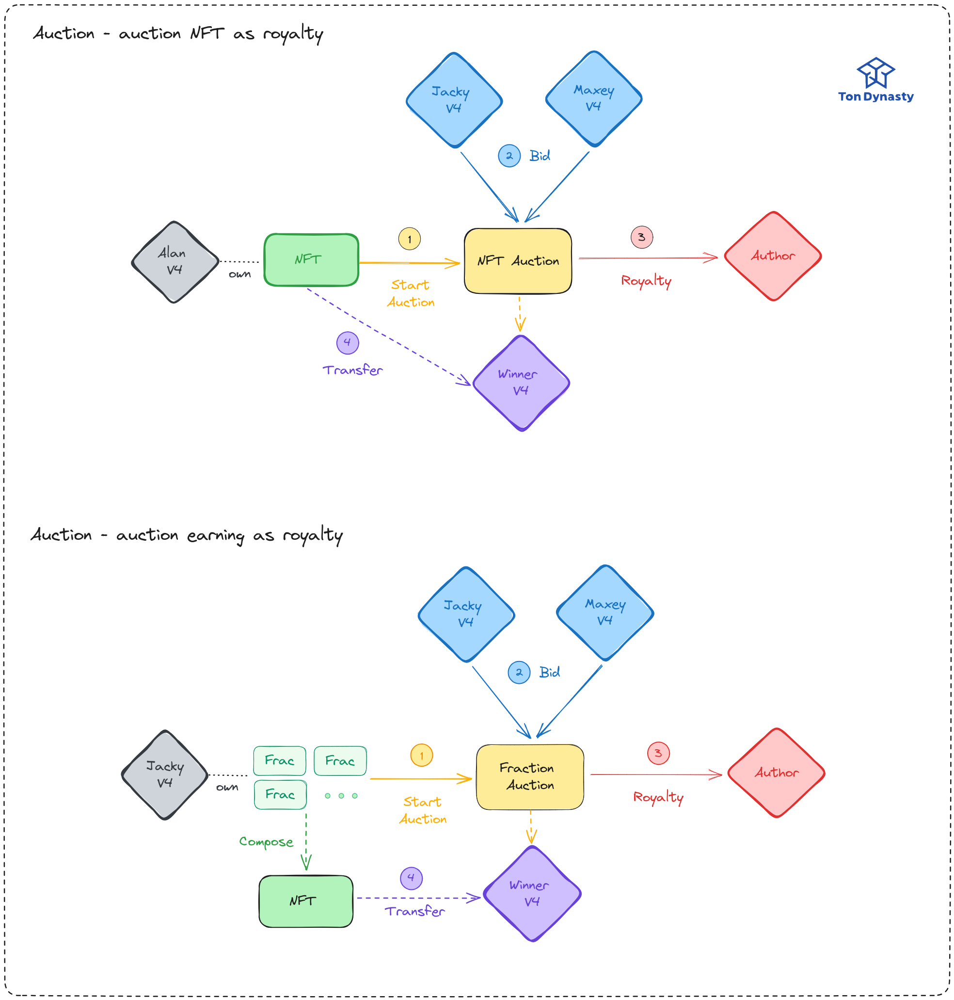

## Introduction

Imagine a world where artists are effortlessly rewarded each time their work changes hands, ensuring their continuous recognition and compensation.💰 Leveraging the groundbreaking power of NFT fractionalization, we've sculpted a solution that is not only intuitively simple but also remarkably effective, seamlessly intertwining with existing NFT standards.

Your journey through the revolutionary pathways of NFT enforced royalties on TON begins here – where the equitable future of digital artistry is being rewritten! 🎨✨

Click **readmore** to learn more about our project.

<!-- truncate -->

## Background

To enhance our understanding of our solution, in this section, we will first introduce the background knowledge of NFT Enforced Royalty and Fractionalization.

### What is NFT & Enforced Royalty?

The advent of NFTs (Non-Fungible Tokens) has introduced a programmable digital asset, serving as a certificate for digital artworks. The concept of NFTs allows creators to continuously track the transfer transactions of users, and with each transfer, creators can obtain a certain percentage of royalties.

Enforced royalty is a hotly debated issue. While it enables creators to obtain deserved earnings, excessively high royalties can also somewhat reduce market liquidity. In August 2023, OpenSea, an NFT platform on Ethereum, decided to discontinue its on-chain royalty enforcement tool — Operator Filter, which allowed creators to block NFT markets that do not enforce royalties. This move may impact NFT artists who expect to generate passive income through royalties, yet it might also rescue a languishing market.

### What is Fractionalization?

**Fractionalization** is a technique that divides an NFT into multiple portions, each of which can be owned by different holders. The emergence of `Fractionalization` significantly enhances the liquidity of NFTs and makes the value of NFTs more readily accepted by the market.

For example, if an NFT is valued at 1000 USD, `Fractionalization` can split it into 100 pieces (often using Fungible Tokens as certificates), each worth 10 USD. In this way, an NFT, originally valued at 1000 USD, can be owned by 100 people and can be freely traded on the market.

We have adapted [Ethereum's NFT Fractionalization](https://www.leewayhertz.com/fractional-nft/) to a model suitable for TON, and applied it to NFT Enforced Royalty.

## Motivation

Discussions about NFT Enforced Royalty are no stranger to the TON blockchain. Thanks to TON's asynchronous nature and the upgradability of contracts, there are even more possibilities for implementing NFT royalty enforcement mechanisms. On TON, the method for obtaining royalties from NFTs is defined in [TEP-0064](https://github.com/ton-blockchain/TEPs/blob/master/text/0064-token-data-standard.md), although it does not prescribe how royalty enforcement should be carried out.

Enforcing royalties on TON, while protecting creators’ rights, might result in a suboptimal user experience. For instance, if someone wishes to gift an NFT to another individual, the royalty enforcement mechanism requires royalties to be paid during the transfer. Consequently, users have to pay additional fees when transferring NFTs, which is not user-friendly.

Therefore, we aim to implement a user-friendly and compatible NFT Enforced Royalty mechanism on TON, ensuring that the execution of NFT royalties does not burden users. We offer various options to users, allowing them to freely choose the royalty enforcement mechanism they desire.

## Discussions

In this section, we discuss the existing needs for NFT Enforced Royalty, and solutions will be proposed in the next section, under **Core Concept**.

### Requirements

:::info

1. NFT Enforced Royalty requires a certain percentage of royalties to be collected based on the transaction amount during every trade.

:::

This point is relatively undisputed as it constitutes the fundamental need for NFT Enforced Royalty.

:::info

2. For NFT transfers without a transaction amount, a certain percentage of royalties needs to be collected without compromising user experience (e.g., imposing a fee during Transfer).

:::

This requirement might be more controversial since it entails users having to pay additional fees when transferring NFTs, an experience that can be perceived as unfriendly to users. However, this requirement also has its rationality. In this way, creators can still obtain a certain percentage of royalties even when NFTs are transferred without a transaction amount.

An intuitive solution is to allow creators to forcibly disable NFTs that haven't paid royalties. However, this allows creators to arbitrarily block NFT transactions, potentially leading to unfairness in the market and affecting the liquidity and value of NFTs. Furthermore, this could render the NFT market **overly centralized**, as creators or copyright holders would possess excessive control. In such circumstances, a balance must be found to ensure equilibrium between the interests of creators and the rights of users.

## Core Concepts - Hybrid Royalty

To find a balance between creators and users, we present three distinct solutions to run concurrently, allowing users to freely choose the royalty enforcement mechanism they desire. All of this while ensuring that creators can obtain a certain percentage of royalties without compromising the user experience.

However, currently, only auctions (Auction) can generate transaction amounts and calculate royalties. So, how can fees be collected during transfers (Transfer)? We introduce a new concept — Hybrid Royalty, which allows NFTs to gain a certain percentage of royalties even during transfers without a transaction amount.

:::tip

In other words, NFT holders still need to pay royalties but have the option to not utilize `TON / Jetton` for payment. They can fractionalize the NFT and extract a certain percentage as royalty.

:::

## Solutions

In this section, we will present, through illustrative examples, how our Hybrid Royalty mechanism facilitates a win-win situation between creators and NFT holders.

### 🎯 Fractionalize

Let’s first talk about our core principle - Paying Royalties using NFT Fragments

#### Steps

1. When **Alan** transfers the **NFT Item**, it gets locked.
2. **NFT Fraction (Jetton)** is minted for **Jacky**.
3. Another portion is minted for the **Author** as a royalty.

These **NFT Fractions** will also have a certain percentage deducted as royalty upon future transfers.

In simple terms, we can consider NFT fragments as a type of share (Share). Future additional earnings will be distributed to the fragment holders. For instance, if someone wants to buy out the NFT (acquiring all fragments), the amount paid for the acquisition will be distributed to each fragment holder according to their share.

However, you might be thinking:

:::danger
**I don’t want my NFT to become fragments! I want to transfer the complete NFT!**
:::

Or maybe

:::danger
**I don’t want the NFT fragments I hold to be buyable at any moment!**
:::

No worries! We offer multiple options to users, allowing them to freely select the royalty enforcement mechanism they prefer. The following **Quota** and **Auction** are solutions that won’t fragmentize the NFT.

### 🎯 Quota

Recognizing that some individuals want to transfer NFTs in their entirety without utilizing time-consuming methods like **Auction**, we offer a solution called **Quota**.

#### Steps

1. The **Author** uses `IssueQuota` to provide **Quota** for everyone to purchase, setting the price and quantity of the **Quota**.
2. Since **Alan** wishes to transfer a complete NFT, he uses `BuyQuota` to purchase **Quota**.
3. **Alan** utilizes `Transfer`, expending `Quota` to transfer the NFT to **Jacky**.

The TON used to pay for the `Quota` will be stored in the `QuotaShop`, and the **Author** can use `Withdraw` to withdraw the TON at any time.

### 🎯 Auction

Next, if you're aiming to sell NFTs and maximize revenue, we present the **Auction** solution. Without relying on intermediaries, you can initiate auctions directly on TON.

Auctions can be categorized into two types, both following the same procedure. At the conclusion, the NFT will be transferred to the highest bidder, and a portion of the winning bid in TON will be transferred to the **Author** as a royalty. If it's an auction to buy out fractional NFTs, the proceeds are distributed proportionally among the shard holders.

1. Auctions intending to sell a complete NFT.
2. Auctions intending to buy out fractional NFTs.

#### Steps

1. **Start Auction** initiates the auction and transfers the NFT to the **Auction Contract**.
2. Bidders use `Bid` to participate in the auction.
3. After the bidding concludes, the **Auction Contract** transfers the NFT to the highest bidder and moves a portion of the winning TON bid to the **Author** as a royalty.

:::tip
In the case of buying out fractional NFTs, we deposit the proceeds into `NFT Fraction (Jetton Master)`. Shard holders can use `Withdraw` at any time to claim their TON according to their share. At this point, the `nullifier` of the `NFT Item` increments by 1, ensuring the `NFT Fraction` in subsequent fractionalizations has a different `nullifier`.

The advantage of this approach is that it eliminates the need to send TON to each shard holder individually. Instead, they can withdraw it themselves, significantly saving on Gas costs.
:::

## Summary

Previously, we introduced various royalty options. Let's summarize their characteristics:

|               | Royalty Payment | Transfer Time                              | User's Timing Preference                                                               |
| ------------- | --------------- | ------------------------------------------ | -------------------------------------------------------------------------------------- |
| Fractionalize | NFT shards      | Short                                      | Desires immediate transfer, without using TON/Jetton for royalty payment               |
| Quota         | TON/Jetton      | Moderate, requires prior purchase of Quota | Wishes to transfer a complete NFT, but doesn't want to wait for an Auction to conclude |
| Auction       | TON             | Long, waits for Auction to conclude        | Wants to transfer a complete NFT and aims to maximize revenue                          |

## Message Flows

## Implementation

We utilized [Tact](https://tact-lang.org/) to compose a series of standard, reusable `traits` following the [TON Enhancement Proposals (TEP)](https://github.com/ton-blockchain/TEPs). These `traits` were then employed to implement our [NFT Enforced Royalty mechanism as previously described](https://github.com/Ton-Dynasty/tondynasty-contracts/blob/main/contracts/nft_enforce_royalty_example.tact). Furthermore, we’ve developed [a suite of tests](https://github.com/Ton-Dynasty/tondynasty-contracts/tree/main/tests/NFTEnforceRoyalty) to validate our implementation of the NFT Enforced Royalty.

## Resources

- [TEP-0062 NFT Standard](https://github.com/ton-blockchain/TEPs/blob/master/text/0062-nft-standard.md)
- [TEP-0064 Token Data Standard](https://github.com/ton-blockchain/TEPs/blob/master/text/0064-token-data-standard.md)
- [TEP-0066 NFT Royalty Standard](https://github.com/ton-blockchain/TEPs/blob/master/text/0066-nft-royalty-standard.md)
- [TEP-0074 Jetton Standard](https://github.com/ton-blockchain/TEPs/blob/master/text/0074-jettons-standard.md)
