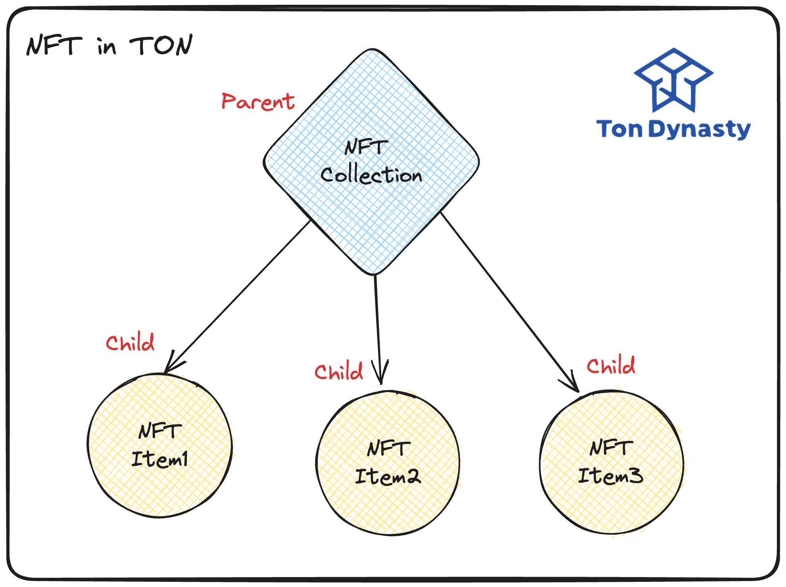
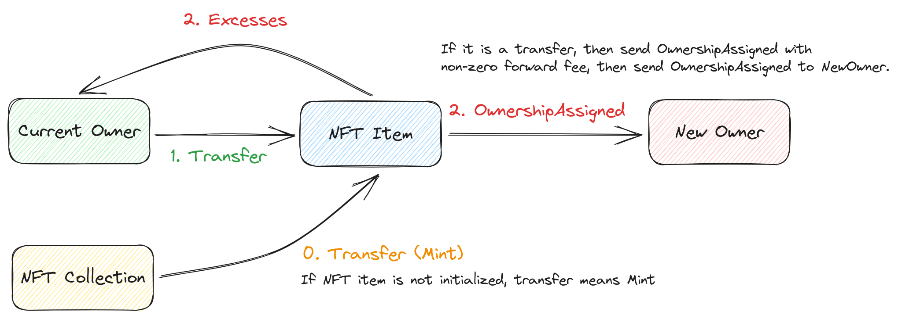

# NFT Collection

This NFT Collection smart contract provides a framework for NFT collections that comply with the [TEP-0062 standard](https://github.com/ton-blockchain/TEPs/blob/master/text/0062-nft-standard.md).

NFT in TON follows parent-child pattern. That is, each NFT item is a child contract of the NFT collection contract.


## Overview

In the TEP-0062 standard, each NFT collection is associated with an NFT Collection smart contract, which stores basic information about the collection, including the next item index, collection content, and owner address.

## Message Flows



Specifically, the `Transfer` flow is as follows:

1. When NFT Item received a `Transfer` message, it will set the current owner to the `newOwner` in payload of `Transfer` message. 
2. Then, an OwnershipAssigned event will send to NewOwner as a notification.
3. Last, if there are remaining funds, the NFT Item will send `Excesses` message to previous owner, attaching with the remaining funds.

### CollectionData Structure

```typescript
struct CollectionData {
    next_item_index: Int;     // collection should issue NFT with sequential indexes starting from 1. -1 value implies non-sequential collections.
    collection_content: Cell; // collection content format should comply with TEP64 
    owner_address: Address;   // collection owner address, zero address if no owner
}
```

### NFTCollectionStandard Trait

```typescript
contract ExampleNFTCollection with NFTCollectionStandard, NFTRoyaltyStandard, Estimatable, Deployable {
    next_item_index: Int as uint32 = 0; // if next_item_index is not -1, means sequential minting is enabled. We want a sequential minting in this example so we set it to uint32.
    collection_content: Cell;           // collection_content may be the prefix of individual_content
    owner_address: Address;             // owner_address is the address of the owner of the collection
    royalty_params: RoyaltyParams;      // royalty_params is the params of royalty
    
    init(owner_address: Address, collection_content: Cell, royalty_params: RoyaltyParams) {
        self.owner_address = owner_address;
        self.collection_content = collection_content;
        self.royalty_params = royalty_params;
    }

    // @dev Mint is not the standard function of NFTCollection, so we need to define it by ourselves
    receive("Mint") {
        let ctx: Context = context();
        let nftItemInit: StateInit = self._get_nft_item_state_init(self.next_item_index);
        send(SendParameters{
                to: contractAddress(nftItemInit), 
                value: self.estimate_rest_value(ctx), 
                bounce: false,
                mode: SendIgnoreErrors,
                body: Transfer {
                    query_id: 0,
                    new_owner: ctx.sender,
                    response_destination: ctx.sender,
                    custom_payload: emptyCell(),
                    forward_amount: 0,
                    forward_payload: emptySlice()
                }.toCell(),
                code: nftItemInit.code,
                data: nftItemInit.data
            });
        self.next_item_index = self.next_item_index + 1;
    }

    // @dev _get_nft_item_state_init returns the initCode of NFTItem
    override inline fun _get_nft_item_state_init(index: Int): StateInit {
        return initOf ExampleNFTItem(myAddress(), index, self.owner_address, self.collection_content);
    }
}
```

## Internal Functions and Get Methods

### Internal Functions

#### `_get_nft_item_state_init(index: Int): StateInit`

Calculates the initial code for the NFT item contract by item index. This function MUST be overridden in a custom contract.

```typescript
abstract inline fun _get_nft_item_state_init(index: Int): StateInit;
```

#### `_get_nft_content(index: Int, individual_content: Cell): Cell`

Gets the serial number of the NFT item of this collection and the individual content of this NFT item, returns the full content of the NFT item in a format that complies with standard TEP-64.

```typescript
// @dev _get_nft_content gets the serial number of the NFT item of this collection and the individual content of this NFT item.
//      returns the full content of the NFT item in format that complies with standard TEP-64.
// @note one MUST override this function to provide full NFT item content
virtual inline fun _get_nft_content(index: Int, individual_content: Cell): Cell {
    let builder: StringBuilder = beginString();
    let idvStr: String = individual_content.asSlice().asString();
    builder.append(idvStr);
    return builder.toCell();
}
```

#### `_get_collection_data(): CollectionData`

Returns NFT collection data.

```typescript
// @dev get_collection_data returns nft collection data
virtual inline fun _get_collection_data(): CollectionData {
    let builder: StringBuilder = beginString();
    let urlPrefix: String = self.collection_content.asSlice().asString();
    builder.append(urlPrefix);
    builder.append(self.NFT_COLLECTION_STANDARD_METADATA);
    return CollectionData {
        next_item_index: self.next_item_index,
        collection_content: builder.toCell(),
        owner_address: self.owner_address
    };
}
```

### Get Methods

#### `get_collection_data(): CollectionData`

Retrieves collection data.

```typescript
get fun get_collection_data(): CollectionData {
    return self._get_collection_data();
}
```

#### `get_nft_address_by_index(index: Int): Address`

Gets the address of the NFT item of this collection by its serial number.

```typescript
// @dev get_nft_address_by_index gets the serial number of NFT item of this collection and returns its address
get fun get_nft_address_by_index(index: Int): Address {
    let initCode: StateInit = self._get_nft_item_state_init(index);
    return contractAddress(initCode);
}
```

#### `get_nft_content(index: Int, individual_content: Cell): Cell`

Calls `_get_nft_content` and returns the full content of the NFT item in a format that complies with standard TEP-64.

```typescript
// @dev get_nft_content calls _get_nft_content and returns the full content of the NFT item in format that complies with standard TEP-64.
get fun get_nft_content(index: Int, individual_content: Cell): Cell {
    return self._get_nft_content(index, individual_content);
}
```

## Usage

### Basic Usage

To utilize the NFT Collection Standard, you need to implement an NFT Collection contract and override essential methods like `_get_nft_item_state_init` and `_get_nft_content`.

```typescript
// Your contract should look something like this
contract YourNFTCollection with NFTCollectionStandard {
    // ... your custom properties and methods ...

    override inline fun _get_nft_item_state_init(index: Int): StateInit {
        // ... your implementation ...
    }

    override inline fun _get_nft_content(index: Int, individual_content: Cell): Cell {
        // ... your implementation ...
    }
}
```

