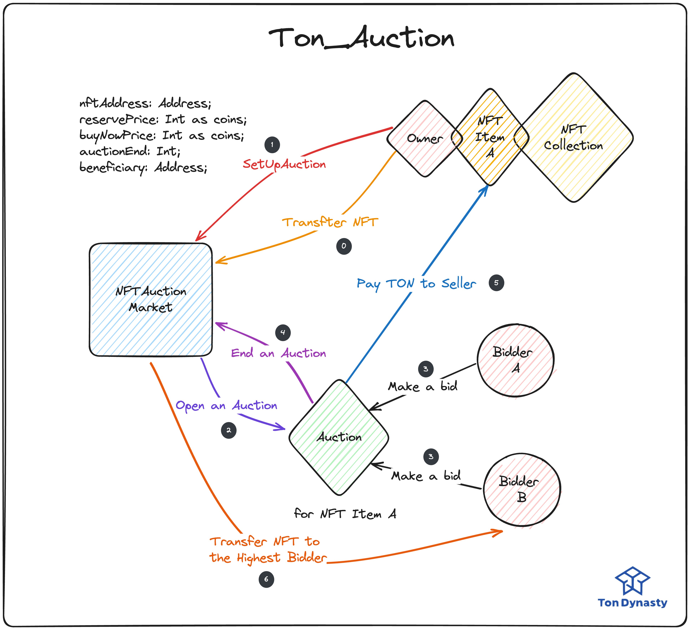

# NFT Auction in TON

實作基礎 TON NFT 拍賣功能

## Architecture

## How does the Auction functionality work?

- 這個智能合約 interface 可以在去中心化且靈活的情況下用於 NFT 的拍賣（或僅購買/出售）。
- 賣家和競標者能夠創建自定義的拍賣和出價，從而實現全面的 NFT 拍賣/銷售機制。

## NFT sellers can perform the following actions to sell or auction their NFTs:

### Create an auction for a single NFT and customize its auction by specifying the following:

- `NFTAddress`: 拍賣的 NFT 的地址。
- `reservePrice`: 當達到此價格時，拍賣開始，用戶有一段特定的時間來進行後續的更高出價。如果也設置了 `buyNowPrice`，則最低價格不能大於 `buyNowPrice`。
- `buyNowPrice`: 當買家達到此價格時，將自動結束拍賣。
- `auctionEnd`: 此競標 NFT 拍賣的期限。
- `defaultAuctionBidPeriod`: 指定拍賣在達到最低價格後將持續的時間。每次達到更高的出價後，拍賣將再次持續這段時間。例如，如果拍賣投標期限設置為 x，並且最低價格在時間 T0 達到，則拍賣將在時間 T0+x 結束。但是，如果在時間 T1（其中 T0 < T1 < T0+x）由另一名競標者出價更高，則拍賣結束時間將更新為時間 T1 +x。
- `defaultBidIncreasePercentage`: 它確定競標者必須存入的金額，以成為最高競標者。因此，如果出價 X 金額，則下一名競標者必須出價 X + ((X \* 出價增加百分比)/10000)。
- `beneficiary`: 當拍賣結束時，將收到拍賣的售價發送的指定的 `Address。`

```typescript
message SetUpAuction {
    nftAddress: Address;            // NFT address to be auctioned
    reservePrice: Int as coins;     // minimum bid price to start the auction timer
    N: Int as coins;      // price at which the NFT can be directly bought
    auctionPeriod: Int as uint256;  // time when the auction ends after it starts
    beneficiary: Address?;           // the address of the beneficiary
}
```

## Bidders can perform the following actions using the Unstoppable Auction contract:

### Customize the auction for a single NFT by specifying the following:

- `bidVale`: 如果已經有人出價，競標者必須出更高的出價增加百分比金額。但如果這已經滿足，競標者無需出更高於賣家設定的最低價格的出價（在這種情況下，拍賣不會開始）。因此，如果在拍賣上沒有出價，競標者可以指定任何金額。
- 用戶還可以進行自定義出價，並指定 NFT 接收者，如果他們的出價成功，則 NFT 將轉移給該接收者。

### Purchase an NFT by specifying the following during the sale:

- 在這種情況下，購買者可以以低於立即購買價格的金額進行出價，這不會結束銷售。然後，購買者必須以比之前的低出價金額高的默認百分比金額進行出價。如果競標者指定的金額等於或高於立即購買價格，則銷售將結束，並且 NFT 和購買金額將被轉移。

## Addtional functions avaliable

Sellers can

- 如果拍賣的最低價格尚未達到，或者在出售時隨時提取他們的拍賣。
- 更新拍賣的最低價格。只有在已經沒有出價超過原始最低價格的情況下，才能進行此操作。
- 更新拍賣或銷售的立即購買價格。如果在拍賣或銷售上已經進行了出價，並且此更新將意味著此出價現在滿足立即購買價格，則將結束拍賣或銷售，並相應分配 NFT 和出價金額。
- 接受最高出價金額並結束拍賣或銷售。

Bidders can

- 在拍賣投標期限已過（最低出價已達到）的情況下，任何用戶都可以結算拍賣並將出價和 NFT 分發給相應的賣家和接收者。
- 當投標者的 `bidVale`，被新的投標者的 `bidVale` 超過時，會將前一筆競價的 `bidVale` 還給投標者，並更新新的最高競標價格以及競價者。
- NFT的Seller不能對自己的NFT拍賣競標。
## Let's TON it up!!!

### With NFTAuctionMarketStandard
Github Repo: <https://github.com/Ton-Dynasty/tondynasty-contracts>

```typescript
trait NFTAuctionMarketStandard {
    owner: Address;
    // Check whether nft is transfered to NFT Auction Market Contract
    auctionTransferCheck: map<Int, Int>; // key => hash(sellerAddress and nftAddress), vlaue => 1: set, 0: not set
    // Check whether nft auction is over or not
    auctionOverCheck: map<Address, Address>;  // key => nft auction contract address, value => 1: not over, 0: over

    // @dev Default parameters for setting up an NFT auction
    virtual const defaultBidIncreasePercentage: Int = 100;
    virtual const defaultAuctionBidPeriod: Int = 86400; // 1 day
    virtual const minimumSettableIncreasePercentage: Int = 100;
    virtual const maximumMinPricePercentage: Int = 8000;
}
```

透過繼承 `NFTAuctionMarketStandard` 快速實作屬於自己的 Auction Contract，可以自行改寫預設基本競價變數。

### Seller 需要先將 NFT 轉移到 Auction Market

```typescript
// @dev Processes the OwnershipAssigned message and updates auction mappings,
//      and confirms NFT transfer to the Auction Market.
receive(msg: OwnershipAssigned) {
    let ctx: Context = context();
    let prev_owner: Address = msg.prev_owner; // Seller Address
    let nftAddress: Address = ctx.sender;
    let hashSellerNftAddress: Int = self.get_hash_seller_nft_address(prev_owner, nftAddress);
    // Set nft transfer checking to 1
    self.auctionTransferCheck.set(hashSellerNftAddress, 1);
    let payload: Slice = msg.forward_payload;

    if(payload.empty() == false) {
        self._parse_forward_payload(prev_owner, nftAddress, payload);
    }
}
```

- Seller 向 NFT Item 發送 `Transfer` message，當 NFT Owner 更改成 Auction Market 後，NFT Item 會發送 `OwnershipAssigned` message 到 Auction Market Cotnract，
  當 Auction Contract 收到訊息後，會紀錄轉移成功。
- Seller 可以利用 `OwnershipAssigned` mesage 的 `custome_payload` 填寫 `SetUpAuction` 的基本函數，若有填寫 `custome_payload，則會同時替` Seller Deploy NFT Auction Contract。
- 若 `custome_payload` 並未填寫，則可以再次向 NFT Auction Market contract 傳送 `SetUpAuction` mesage，並 Deploy NFT Auction Contract。

```typescript
// @dev Handles the receipt of a SetUpAuction message.
//      First, it verifies if the NFT has been transferred to the NFT Auction Market Contract.
//      Upon successful validation, it sets up the auction for the specified NFT and deploys
//      a new NFT Auction Contract instance for it.
receive(msg: SetUpAuction) {
    let ctx: Context = context();
    let sellerAddress: Address = ctx.sender;
    let hashSellerNftAddress: Int = self.get_hash_seller_nft_address(sellerAddress, msg.nftAddress);
    self._auction_transfer_validate(hashSellerNftAddress);
    if(msg.beneficiary == null) {
        msg.beneficiary = sellerAddress;
    }
    // Set up auction info
    let auctionInfo: AuctionInfo = self._set_up_auction(sellerAddress, msg.nftAddress, msg.reservePrice, msg.N, msg.auctionPeriod, msg.beneficiary!!); // set up auction
    self._set_price_validate(msg.buyNowPrice, msg.reservePrice);
    let nftAuctionInit: StateInit = self._nft_auction_init(msg.nftAddress, sellerAddress);
    let nftAuctionAddress: Address = self.get_nft_auction_address(msg.nftAddress, sellerAddress);
    self._auction_set_validate(nftAuctionAddress);
    self.auctionOverCheck.set(nftAuctionAddress, msg.nftAddress);

    // Deploy a new NFT Auction Contract
    self._build_auction(nftAuctionAddress, auctionInfo, nftAuctionInit);
}
```

### Auction Market 成功建立專屬的 NFT Auction Contract 後

- 競標者可以向 NFT Auction Contract，發送 `Bid` message，向此 NFT 競標，`message.value` 即是投標價格。
- Auction Market 收到 `Bid` 訊息後，會先檢查 this auction is still active or not.

```ts
// Check if auction is still active.
require(now() < self.auctionEndTime || self.auctionEndTime == 0, "Auction ended");
require(self.isInitialized == 1, "Contract is not initialized");
require((now() < self.auctionBidPeriod) |(self.auctionBidPeriod == 0), "Auction bid period ended");
```

- 檢查`bidValue`是否超過`buyNowPrice`
``` ts
let bidValue: Int = ctx.value;
let buyNowPrice: Int = self.auctionInfo.buyNowPrice;
if(bidValue >= buyNowPrice) {
    self.auctionInfo.nftHighestBid = bidValue;
    // Pay winning bid amount to seller.
    self._send_winning_bid_amount();
    // Transfer NFT to buyer
    self._transfer_nft(buyer);
    self.isInitialized = 0;
    return;
}
```
- 若沒有超過直購價，則會檢查是否有超過目前最高競標價的最低加價比例
```ts
let bidIncreaseAmount: Int = (self.auctionInfo.nftHighestBid * (10000 + self.auctionInfo.bidIncreasePercentage)) / 10000;
require(bidValue > bidIncreaseAmount, "Bid doesn't meet the minimum increase requirement");
```

- 若有超過加價比例，則會將Previos Highest Bid Value送還給Previos Highest Bidder。
```ts
// Send back previous highest bid to previous highest bidder.
let prevNftHighestBidder: Address = self.auctionInfo.nftHighestBidder;
let prevNftHighestBid: Int = self.auctionInfo.nftHighestBid;
let paybackTon: Int = max(prevNftHighestBid - self.minTonsForStorage - self.gasConsumption,0);
send(SendParameters{
    to: prevNftHighestBidder,
    value: paybackTon, 
    mode: SendPayGasSeparately, 
    bounce: false,
    body: "Pay bid money back to the prevNftHighestBidder".asComment()
});
```
- Update Highest Bid、Bidder以及Auction Bid Period
```ts
// Update highest bid and Transfer ton back to previous highest bidder.
self.auctionInfo.nftHighestBidder = ctx.sender;
self.auctionInfo.nftHighestBid = bidValue;
// If bid value is greater than reserve price, then the auction is being started.
if(bidValue > self.auctionInfo.reservePrice) {
    self._update_auction_bid_period();
    if(self.auctionEndTime == 0) { 
        // If the auction start, then set the auction end time.
        self._update_auction_end_time();
    }
}
```
### 結算NFT Auction

- 當Auction Bid Period結束都沒人提出更高的競價，則任何人都可以向Autction contract發送結算的Message。
- 若Auction已經開始(競價已經超過`reservePrice`)，Auction結束後，會將`BidValue`傳送給Seller，並轉移NFT給Bidder。
- 若Auction尚未開始，則會將NFT轉還給Seller。
```ts
// @dev Ends the auction and transfers the NFT to the highest bidder or back to the seller(If autcion not started)
receive("EndAuction") {
    // If this auction started, it will transfer NFT to highest bidder.
    // Else, it will transfer NFT to seller.
    if(self.auctionEndTime > 0) {
        // Pay royalty to the creator of the NFT
        // TODO: Implement royalty payment
        
        // Pay winning bid amount to seller.
        self._send_winning_bid_amount();
        // Transfer NFT to buyer
        let buyer: Address = self.auctionInfo.nftHighestBidder;
        self._transfer_nft(buyer);
        self.isInitialized = 0;
    }
    else {
        // Transfer NFT to seller
        let seller: Address = self.auctionInfo.nftSeller;
        self._transfer_nft(seller);
        self.isInitialized = 0;
    }
}
```
- 將NFT轉移給新Owner
- 發送`TransferNFT` Message給NFT Auction Contract，再將NFT轉移給新Owner
```ts
// @dev Transfer the NFT to the highest bidder
// @note If you want change msg value, you should make sure that is enough for NFT Auction market contract to transfer NFT.
virtual inline fun _transfer_nft(buyer: Address) {
    send(SendParameters{
        to: self.owner, 
        value: ton("0.06"), 
        bounce: true,
        mode: SendPayGasSeparately,
        body: TransferNFT {
            nftAddress: self.nftAddress,
            seller: self.auctionInfo.nftSeller,
            query_id: 0,
            new_owner: buyer,
            response_destination: buyer,
            custom_payload: emptyCell(),
            forward_amount: 0,
            forward_payload: emptySlice()
        }.toCell()
    });
}
```
- NFT Auction Contract收到轉移NFT的訊息後，對NFT Item發送`Transfer` message更換Owner
```ts
// @dev Handles the TransferNFT message and facilitates NFT transfer to the auction's winning bidder.
receive(msg: TransferNFT) {
    let ctx: Context = context();
    let nftAuctionAddress: Address = ctx.sender;
    self._auction_not_set_validate(nftAuctionAddress);
    send(SendParameters{
        to: msg.nftAddress, 
        value: 0, 
        bounce: false,
        mode: SendRemainingValue,
        body: Transfer {
            query_id: msg.query_id,
            new_owner: msg.new_owner,
            response_destination: msg.response_destination,
            custom_payload: msg.custom_payload,
            forward_amount: msg.forward_amount,
            forward_payload: msg.forward_payload
        }.toCell()
    });
    self.auctionOverCheck.set(ctx.sender, null);
    let hashSellerNftAddress: Int = self.get_hash_seller_nft_address(msg.seller, msg.nftAddress);
    self.auctionTransferCheck.set(hashSellerNftAddress, null);
}
```
## Auction Example Code
- NFT Auction Market Trait Link: <https://github.com/Ton-Dynasty/tondynasty-contracts/blob/main/contracts/packages/token/nft/NFTAuctionMarket.tact>
- NFT Auction Trait Link: <https://github.com/Ton-Dynasty/tondynasty-contracts/blob/main/contracts/packages/token/nft/NFTAuction.tact>
```ts
import "@stdlib/deploy";
import "./packages/token/nft/NFTAuctionMarket";
import "./packages/token/nft/NFTAuction";
contract ExampleNFTAuctionMarket with Deployable, NFTAuctionMarketStandard {
    owner: Address;
    // Get auction info by seller address and nft address.
    nftContractAuctions: map<Int, AuctionInfo>; // key => hash(sellerAddress and nftAddress), value => AuctionInfo
    // Check whether nft is transfered to NFT Auction Market Contract
    auctionTransferCheck: map<Int, Int>; // key => hash(sellerAddress and nftAddress), vlaue => 1: set, 0: not set
    // Get auction info by nft collection address and nft id.
    collectionNftIdToAuction: map<Int, Int>; // key => hash(nft collection address and nft id), value => hash(sellerAddress and nftAddress)
    // Check whether nft auction is over or not
    auctionOverCheck: map<Address, Address>;  // key => nft auction contract address, value => 1: not over, 0: over
    init(owner: Address) {
        self.owner = owner;
    }

    // @dev Retrieves the initial state for the NFT auction contract.
    override get fun _nft_auction_init(nftAddress: Address, seller: Address): StateInit {
        return initOf ExampleNFTAuction(myAddress(), nftAddress, seller);
    }
}

contract ExampleNFTAuction with NFTAuctionStandard {
    owner: Address;
    nftAddress: Address;
    seller: Address;
    auctionInfo: AuctionInfo;
    auctionBidPeriod: Int;
    isInitialized: Int;
    auctionEndTime: Int;

    init(owner: Address, nftAddress: Address, seller: Address) {
        self.owner = owner;
        self.nftAddress = nftAddress;
        self.seller = seller;
        self.auctionBidPeriod = 0;
        self.auctionEndTime = 0;
        self.isInitialized = 0;
        self.auctionInfo = AuctionInfo {
            bidIncreasePercentage: 0,
            auctionBidPeriod: 0,
            auctionPeriod: 0,
            reservePrice: 0,
            buyNowPrice: 0,
            nftHighestBid: 0,
            nftHighestBidder: newAddress(0, 0),
            nftSeller: seller,
            whitelistedBuyer: seller,
            nftRecipient: seller,
            beneficiary: seller
        };
    }
}

```

## Addtional Functions 
### Revise SetUp Auction
- 當拍賣還未開始時，Seller可以更改`reserve_price`以及`buyNowPrice`
- 向NFT Autcion Market發送`ReviseSetUpAuction` message
```ts
// @dev Updates auction details after verifying NFT transfer and previous auction setup, then communicates the update to the nftAuctionAddress.
receive(msg: ReviseSetUpAuction) {
    let ctx: Context = context();
    let sellerAddress: Address = ctx.sender;
    let hashSellerNftAddress: Int = self.get_hash_seller_nft_address(sellerAddress, msg.nftAddress);
    self._auction_transfer_validate(hashSellerNftAddress);
    // Get nft auction address
    let nftAuctionAddress: Address = self.get_nft_auction_address(msg.nftAddress, sellerAddress);
    self._auction_not_set_validate(nftAuctionAddress);
    if(msg.beneficiary == null) {
        msg.beneficiary = sellerAddress;
    }
    // Set up auction info
    let auctionInfo: AuctionInfo = self._set_up_auction(sellerAddress, msg.nftAddress, msg.reservePrice, msg.buyNowPrice, msg.auctionPeriod, msg.beneficiary!!); // set up auction
    self.auctionOverCheck.set(nftAuctionAddress, msg.nftAddress);
    let newAuctionInfo: AuctionInfo = self._set_up_auction(sellerAddress, msg.nftAddress, msg.reservePrice, msg.buyNowPrice, msg.auctionPeriod, msg.beneficiary!!); // set up auction
    send(SendParameters{
            to: nftAuctionAddress,
            value: 0,
            mode: SendRemainingValue,
            bounce: false,
            body: ReviseAuction {
                reviseAuctionInfo: newAuctionInfo
            }.toCell()
        }
    );
}
```
- NFT Auction Market會向NFT Auction Contract發送更改訊息
```ts
// @dev Allows owner to adjust auction's reserve or buy-now prices.
receive(msg: ReviseAuction) {
    let ctx: Context = context();
    require(ctx.sender == self.owner, "Only owner can revise auction contract");
    require(self.auctionInfo.reservePrice == msg.reviseAuctionInfo.reservePrice || msg.reviseAuctionInfo.buyNowPrice == self.auctionInfo.buyNowPrice, "Cannot update reserve price and buy now price at the same time.");

    // Update the reserve price of the auction.
    // This can only be done if no bid has been made that already exceeds the original minimum price.
    if(self.auctionEndTime == 0 && self.auctionInfo.reservePrice != msg.reviseAuctionInfo.reservePrice && msg.reviseAuctionInfo.reservePrice < self.auctionInfo.buyNowPrice) {

        self.auctionInfo.reservePrice = msg.reviseAuctionInfo.reservePrice;
        if(self.auctionInfo.nftHighestBid > self.auctionInfo.reservePrice) {
            self._update_auction_bid_period();
            self._update_auction_end_time();
        }
    }
    // Update the buy now price of the auction.
    // This can only be done if no bid has been made that already exceeds the original minimum price.
    if(self.auctionEndTime == 0 && msg.reviseAuctionInfo.buyNowPrice != self.auctionInfo.buyNowPrice && msg.reviseAuctionInfo.buyNowPrice > self.auctionInfo.reservePrice) {
        self.auctionInfo.buyNowPrice = msg.reviseAuctionInfo.buyNowPrice;
    }
}
```
### EndAuction
- 若Seller想要提前終止拍賣，則可以向NFT Auction Market傳送`EndAuction` message
```ts
// @dev Allows the seller to terminate an auction. 
//      It verifies if the auction was previously set and then sends a message to the nftAuctionAddress to conclude the auction.
//      It will transfer the NFT to the highest bidder or back to the seller(If autcion not started).
receive(msg: EndAuction) {
    // Seller can end auction.
    let ctx: Context = context();
    let sellerAddress: Address = ctx.sender;
    let hashSellerNftAddress: Int = self.get_hash_seller_nft_address(sellerAddress, msg.nftAddress);
    let nftAuctionAddress: Address = self.get_nft_auction_address(msg.nftAddress, sellerAddress);
    self._auction_not_set_validate(nftAuctionAddress);
    send(SendParameters{
            to: nftAuctionAddress,
            value: 0,
            mode: SendRemainingValue,
            bounce: false,
            body: "EndAuction".asComment()
        }
    );
}
```
- 若拍賣已經開始，則馬上結標傳送給目前的Highest Bidder，並把`BidValue`傳送給Seller
- 若拍賣尚未開始，則將NFT轉換給Seller
```ts
// @dev Ends the auction and transfers the NFT to the highest bidder or back to the seller(If autcion not started)
    receive("EndAuction") {
        // If this auction started, it will transfer NFT to highest bidder.
        // Else, it will transfer NFT to seller.
        if(self.auctionEndTime > 0) {
            // Pay royalty to the creator of the NFT
            // TODO: Implement royalty payment
            
            // Pay winning bid amount to seller.
            self._send_winning_bid_amount();
            // Transfer NFT to buyer
            let buyer: Address = self.auctionInfo.nftHighestBidder;
            self._transfer_nft(buyer);
            self.isInitialized = 0;
        }
        else {
            // Transfer NFT to seller
            let seller: Address = self.auctionInfo.nftSeller;
            self._transfer_nft(seller);
            self.isInitialized = 0;
        }
    }
```