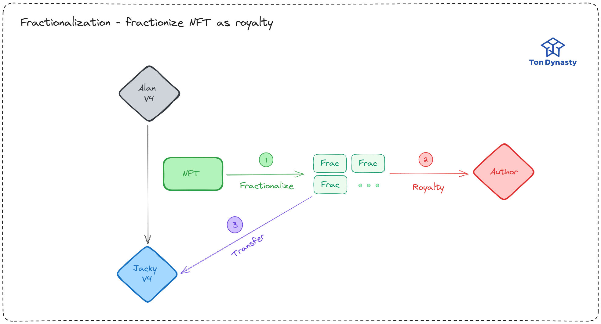
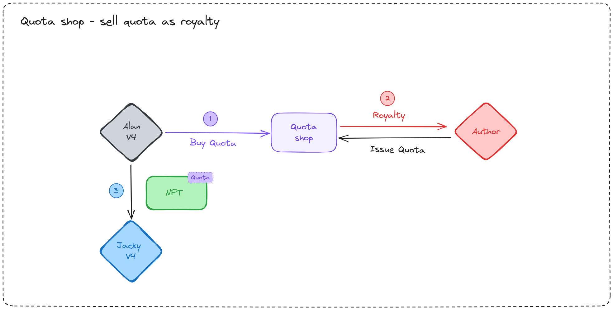
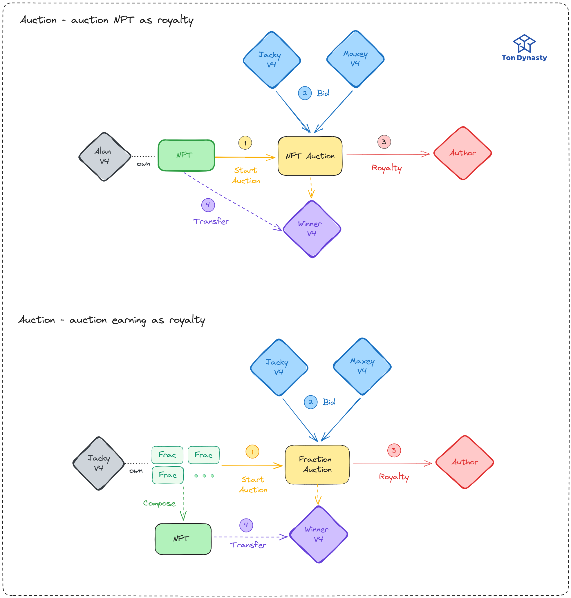

## Introduction

數位藝術工作者們請盡情激發你們的創意吧！過去，由於 NFT 強制版稅執行帶來的負面影響，導致藝術家令人驚詫的創造力往往未能換得應得的回報。而現在，TonDynasty 為了解決這個問題，我們推出了一個全新的解決方案—— Hybrid NFT Enforced Royalty，並在 TON 上成功實現了這一機制。我們也關注使用者體驗，讓各位 NFT Holders 能夠自由徜徉在 `TON` 的世界裡！

點擊 **閱讀更多** 來深入了解我們的 NFT Enforced Royalty 設計文檔。

<!-- truncate -->

## Background

為了更好的理解我們的解決方案，我們在這個章節會先介紹 NFT Enforced Royalty 和 Fractionalization 的背景知識。

### What is NFT & Enforced Royalty?

NFT (Non-Fungible Token) 的出現提供了一種可程式化的數位資產，也作為數位藝術品的憑證。NFT 的提出允許作家們能夠持續追蹤使用者的轉手交易 (transfer)，並且在每次轉手交易時，作家們可以獲得一定比例的版稅。

強制執行版稅是一個備受討論的議題，強制版稅可以使創作者獲得應有的收益，不過過高的版稅也會一定程度降低市場的流通性。2023 年 8 月，以太坊上的 NFT 平台 OpenSea 決定取消其鏈上版稅執行工具 — Operator Filter，該工具允許創作者封鎖不執行版稅的 NFT 市場。此舉可能對期望通過版稅獲得被動收入的 NFT 藝術家造成影響，不過可能因此拯救低迷的市場。

### What is Fractionalization?

`Fractionalization` 是一種將 NFT 分割成多個部分的技術，這些部分可以被不同的持有者擁有。`Fractionalization` 的出現使得 NFT 的流通性大幅提升，也使得 NFT 的價值更加容易被市場所接受。

舉例來說一個 NFT 的價值為 1000 USD，`Fractionalization` 可以將其分割成 100 個部分（通常使用 Fungible Token 來作為憑證），每個部分價值 10 USD，這樣一來，原本價值 1000 USD 的 NFT 就可以被 100 個人擁有，並且可以在市場上自由交易。

我們將 [Ethereum 的 NFT Fractionalization](https://www.leewayhertz.com/fractional-nft/) 改造成適合 TON 的模式，並且將其應用在 NFT Enforced Royalty 上。

## Motivation

在 TON blockchain 上不乏有 NFT Enforced Royalty 相關的討論，由於 TON 的異步和合約可升級等特性，NFT 的版稅執行機制也有了更多的可能性。在 TON 上，NFT 的版稅在 [TEP-0064](https://github.com/ton-blockchain/TEPs/blob/master/text/0064-token-data-standard.md) 中有訂定取得版稅的方式，不過並沒有規定版稅的執行方式。

在 TON 上強制執行版稅雖然可以保障創作者的權益，但可能會造成使用者體驗不佳的情形，舉例來說：一個人想要對持有 NFT 的錢包進行升級，由於升級後錢包地址改變，需要轉移原先地址擁有的 NFT。不過由於 NFT 的版稅執行機制，轉移 NFT 時需要支付版稅，這樣一來就會造成使用者在轉移 NFT 時需要支付額外的費用，這樣的體驗對於使用者來說是不友善的。

因此，我們想要在 TON 上實現使用者友善並且兼容性的 NFT Enforced Royalty 機制，使得 NFT 的版稅執行不會對使用者造成負擔。我們提供了多種選項給使用者，讓使用者可以自由選擇自己想要的版稅強制執行機制。

## Discussions

我們在這個章節討論現有 NFT Enforced Royalty 的需求，並且會在下一章節的 **Core Concept** 中提出解決方案。

### Requirements

:::info
1. NFT Enforced Royalty 在每次進行交易時，都要根據交易額收取一定比例的版稅。
:::

這個比較沒有異議，因為這是 NFT Enforced Royalty 的基本需求。

:::info
2. NFT 在沒有交易額的換手 (Transfer) 時，需要在不影響使用者體驗的情況下 (e.g. Transfer 的時候要收取)，收取一定比例的版稅。
:::

這個需求可能是比較有爭議的，因為這樣一來，使用者在轉移 NFT 時需要支付額外的費用，這樣的體驗對於使用者來說是不友善的。不過這個需求也是有其合理性的，因為這樣一來，創作者可以在 NFT 沒有交易額的換手時，也能夠獲得一定比例的版稅。

一個很直覺的解決方式是讓作者能夠強制禁用沒有繳交版稅的 NFT，不過這樣一來，作者就可以隨意封鎖 NFT 的交易，可能造成市場上的不公平，並影響到 NFT 的流通性和價值。此外，這也可能會使得 NFT 的市場變得**過於中心化**，因為創作者或版權持有人會有過大的控制權。在這種情況下，需要尋找一個平衡點，以確保創作者的利益和使用者的權利之間的平衡。

## Core Concepts - Hybrid Royalty

為了找到創作者和使用者之間的平衡點，我們提出了三種不同的解決方案同時運行，讓使用者可以自由選擇自己想要的版稅強制執行機制，並且在不犧牲使用者體驗的情況下，同時讓創作者能夠獲得一定比例的版稅。

不過，目前唯有拍賣 (Auction) 能夠產生交易額並計算版稅，那在換手（Transfer）的時候如何收取費用呢？我們提出了一個新的概念 — Hybrid Royalty，讓 NFT 在沒有交易額的換手時，也能夠獲得一定比例的版稅。

:::tip

也就是說 NFT 持有者依然需要支付版稅，但是可以選擇不使用 `TON / Jetton` 來支付，可以將 NFT 碎片化並抽取其中一定比例作為版稅。

:::

## Solutions

我們在這個章節會以圖例的方式呈現，舉例說明我們的 Hybrid Royalty 機制是如何讓創作者和 NFT 持有者之間達到雙贏的。

### 🎯 Fractionalize

我們先講述我們的核心 - 使用 NFT 碎片支付版稅

#### Steps

1. 當 **Alan** 轉移 **NFT Item** 時，**NFT Item** 會被鎖定
2. 鑄造 **NFT Fraction (Jetton)** 給 **Jacky**
3. 另一部份會鑄造給 **Author** 作為版稅。

這些 **NFT Fraction** 未來再轉移給其他人時，也會扣除一定比例的版稅。

簡單來說，我們可以將 NFT 碎片當作是一種股份（Share），未來的額外收益都會交給持有碎片的人，例如說有人要買斷 NFT （收購所有碎片），那收購所付出的金額就會依照碎片的比例分配給每個碎片的持有者。

不過看到這裡，你可能會想：

:::danger
**我不想要我的 NFT 變成碎片！我想要轉移完整的 NFT！**
:::

或是

:::danger
**我不想要我持有的 NFT 碎片隨時都能被收購！**
:::

沒關係！我們提供了多種選項給使用者，讓使用者可以自由選擇自己想要的版稅強制執行機制。接下來的 **Quota** 和 **Auction** 就是不會碎片化的解決方案。

### 🎯 Quota

有鑑於有些人想要完整的轉移 NFT，但是又不想要藉由 **Auction** 這種耗時間的方式來轉移，我們提供了 **Quota** 這種解決方案。

#### Steps

1. **Author** 會使用  `IssueQuota` 來提供 **Quota** 讓大家來購買，並且會訂定 **Quota** 的價格與數量
2. 由於 **Alan** 想要轉移完整的 NFT，所以他會使用 `BuyQuota` 來購買 **Quota**
3. **Alan** 會使用 `Transfer` ，消耗 `Quota` 來轉移 NFT 給 **Jacky**

用於支付 `Quota` 的 TON 會存儲在 `QuotaShop` 中，**Author** 可以隨時使用 `Withdraw` 將 TON 提領出來。

### 🎯 Auction

再來，如果你期望能夠出售 NFT 並且獲得最大化的收入，那麼我們提供了 **Auction** 這種解決方案，不必再依靠中介人，你可以直接在 TON 上自己開啟拍賣。

拍賣分為兩種，兩種模式流程相同，在結束的時候會將 NFT 轉移給最高出價者，並且將得標的一部分 TON 轉移給 **Author** 作為版稅。如果是買斷 NFT 碎片，收益則由持有碎片的人依照比例分配。

1. 想要出售完整 NFT 的拍賣
2. 想要買斷 NFT 碎片的拍賣

#### Steps

1. **Start Auction** 會開啟拍賣，並且將 NFT 轉移給 **Auction Contract**
2. 競標者會使用 `Bid` 來競標
3. 競標結束後，**Auction Contract** 會將 NFT 轉移給最高出價者，並且將得標的一部分 TON 轉移給 **Author** 作為版稅

:::tip
如果是買斷 NFT 碎片，我們會將收益存入 `NFT Fraction (Jetton Master)`，持有碎片的人可以隨時使用 `Withdraw` 將 TON 依照提領出來。此時 `NFT Item` 的 `nullifier` 會加 1 ，讓下次碎片化的 `NFT Fraction` 會有不同的 `nullifier`。

這樣做的好處是不用一一發送 TON 給每個持有碎片的人，而是讓他們自己來提領，這樣一來可以節省很多 Gas。
:::

## Summary

上面介紹了我們不同的版稅選擇，我們來總結一下他們的特性

|               | 版稅支付     | 轉移時間                  | 使用者選用時機                                     |
| ------------- | ------------ | ------------------------- | -------------------------------------------------- |
| Fractionalize | NFT 碎片     | 短                        | 想要立即轉移，並且不想使用 TON / Jetton 來支付版稅 |
| Quota         | TON / Jetton | 中，需要事先購買 Quota    | 想要轉移完整的 NFT，但不想等待 Auction 結束        |
| Auction       | TON          | 長，需要等待 Auction 結束 | 想要轉移完整的 NFT，並且想要最大化收入             |

## Message Flows

## Implementation 

我們使用了 [Tact](https://tact-lang.org/) 按照 [TON Enhancement Proposals (TEP)](https://github.com/ton-blockchain/TEPs) 撰寫了一系列的標準、可複用的 `traits`，並且使用這些 `traits` 來實作我們[上述說明的 NFT Enforced Royalty 機制](https://github.com/Ton-Dynasty/tondynasty-contracts/blob/main/contracts/nft_enforce_royalty_example.tact)。並且針對 NFT Enfroced Royalty 撰寫了[一系列的 Test 來驗證我們的實作](https://github.com/Ton-Dynasty/tondynasty-contracts/tree/main/tests/NFTEnforceRoyalty)。

<GithubBookmark owner="Ton-Dynasty" repoName="tondynasty-contracts" />

## Resources

- [TEP-0062 NFT Standard](https://github.com/ton-blockchain/TEPs/blob/master/text/0062-nft-standard.md)
- [TEP-0064 Token Data Standard](https://github.com/ton-blockchain/TEPs/blob/master/text/0064-token-data-standard.md)
- [TEP-0066 NFT Royalty Standard](https://github.com/ton-blockchain/TEPs/blob/master/text/0066-nft-royalty-standard.md)
- [TEP-0074 Jetton Standard](https://github.com/ton-blockchain/TEPs/blob/master/text/0074-jettons-standard.md)
